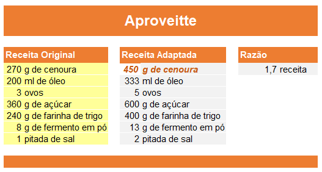

# Aproveitte

Pensando em receitas a partir dos ingredientes que possui.
Aproveitte tudo o que tem, zero despedícios!

## Exemplos

### Bolo de Cenoura

Tinha em casa muita cenoura para o tanto que consumimos em casa (450g).

Já sabia de uma receita boa, achei ela e converti para aproveitar todas cenouras:

#### Ideias de desenvolvimento

- Escolher uma receita de um site de receitas
- Extrair a receita original
- Escolher qual ingrediente é a base
- Achar a relação da quantidade entre o que possui e o que é exigido na receita
- Calcular as quanidades dos demais itens
- Feito isso usando um navegador pensar em uma solução para smartphones